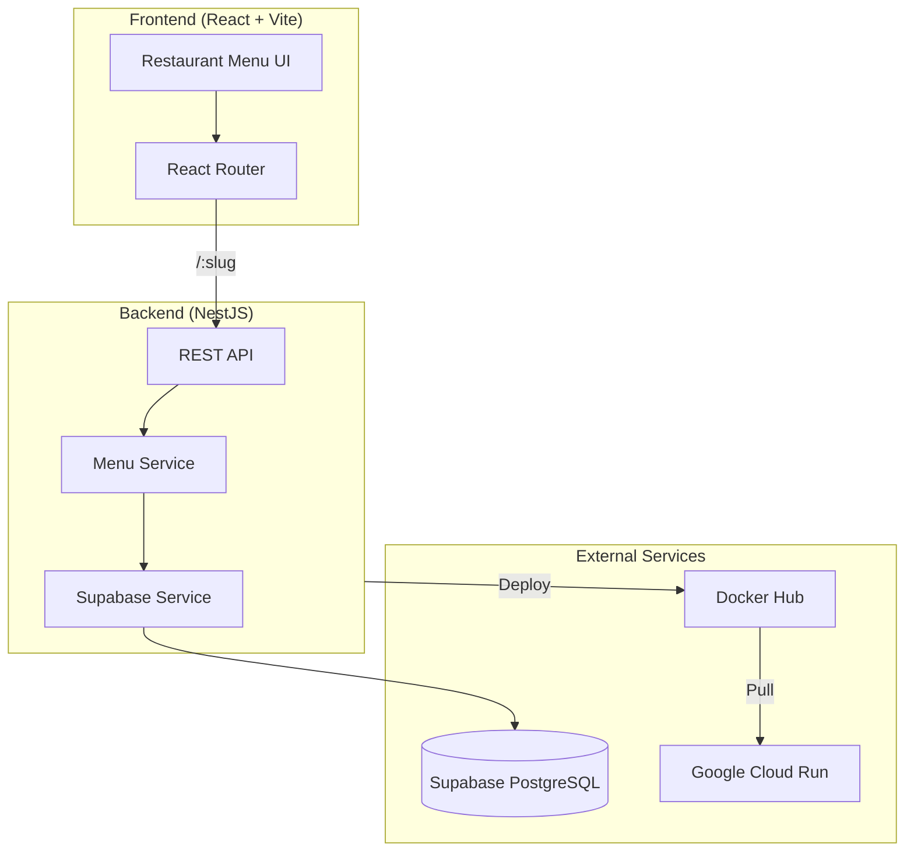
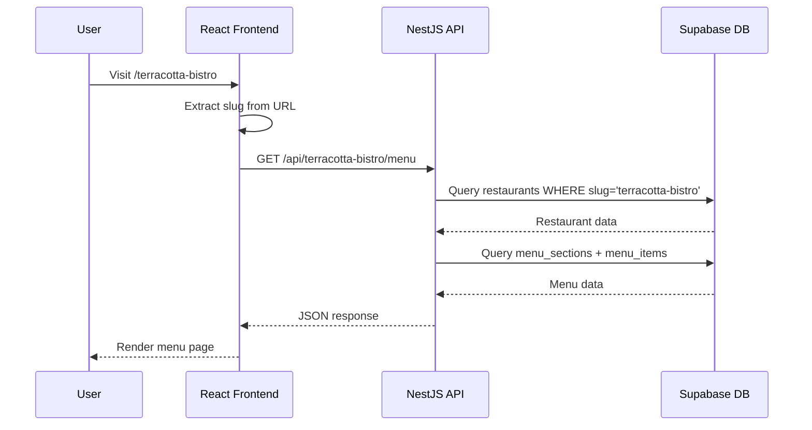
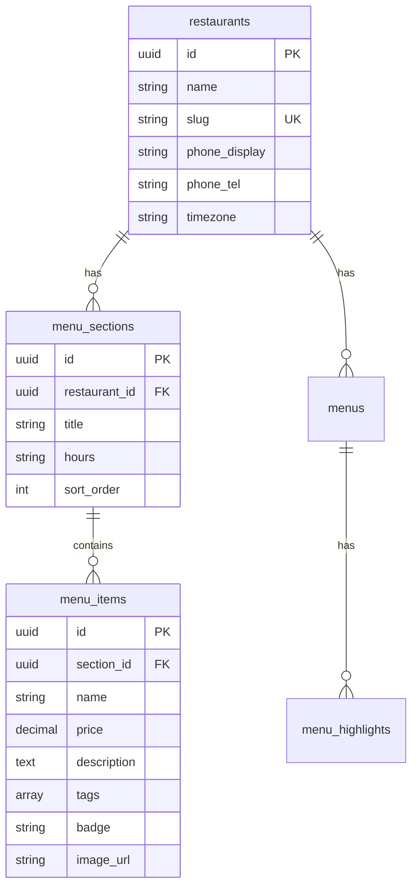

# 🍽️ Restaurant Menu SaaS

A multi-tenant restaurant menu platform built with React and NestJS. Restaurants can dynamically manage their daily menus, and customers access them via unique URLs.

---

## 🏗️ Architecture Overview



---

## 🔄 Request Flow



---

## 📁 Project Structure

```
restaurant/
├── terracotta-ui/              # React Frontend
│   ├── src/
│   │   ├── pages/
│   │   │   ├── Home.jsx        # Main menu page
│   │   │   └── About.jsx       # About page
│   │   ├── lib/
│   │   │   └── api.js          # API client
│   │   ├── ui/                 # Reusable components
│   │   └── App.jsx             # Router setup
│   └── .env.example
│
├── backend-nest/
│   └── restaurent-backend/     # NestJS Backend
│       ├── src/
│       │   ├── menu/           # Menu module
│       │   │   ├── menu.controller.ts
│       │   │   ├── menu.service.ts
│       │   │   └── menu.types.ts
│       │   ├── supabase/       # Database module
│       │   │   ├── supabase.module.ts
│       │   │   └── supabase.service.ts
│       │   ├── app.controller.ts
│       │   ├── app.service.ts
│       │   └── main.ts
│       ├── supabase/
│       │   └── migrations/     # SQL migration files
│       ├── Dockerfile
│       └── .env.example
│
└── backend/                    # (Legacy) Express backend
```

---

## 🗄️ Database Schema



---

## 🌐 External Services

| Service              | Purpose                      | Connection                                   |
| -------------------- | ---------------------------- | -------------------------------------------- |
| **Supabase**         | PostgreSQL database hosting  | Backend connects via `@supabase/supabase-js` |
| **Docker Hub**       | Container registry           | Stores backend Docker images                 |
| **Google Cloud Run** | Serverless container hosting | Pulls from Docker Hub, runs backend          |

---

## 🚀 API Endpoints

| Method | Endpoint                   | Description                 |
| ------ | -------------------------- | --------------------------- |
| `GET`  | `/health`                  | Health check                |
| `GET`  | `/api/:slug/menu?days=3`   | Get menu for restaurant     |
| `GET`  | `/api/:slug/menu/:dateKey` | Get menu for specific date  |
| `GET`  | `/api/:slug/contact`       | Get restaurant contact info |

---

## 💻 Local Development

### Prerequisites

- Node.js 20+
- npm
- Supabase account (free tier works)

### 1. Clone and Install

```bash
git clone <repo-url>
cd restaurant
```

### 2. Set Up Supabase Database

1. Create a project at [supabase.com](https://supabase.com)
2. Go to SQL Editor and run:
   - `backend-nest/restaurent-backend/supabase/migrations/001_initial_schema.sql`
   - `backend-nest/restaurent-backend/supabase/migrations/002_seed_data.sql`
3. Get your credentials from Settings → API

### 3. Start the Backend

```bash
cd backend-nest/restaurent-backend

# Create .env file
cp .env.example .env
# Edit .env with your Supabase credentials:
# SUPABASE_URL=https://your-project.supabase.co
# SUPABASE_ANON_KEY=your-anon-key

npm install
npm run start:dev
```

Backend runs at `http://localhost:4000`

### 4. Start the Frontend

```bash
cd terracotta-ui

# Optional: Create .env to override API URL
cp .env.example .env

npm install
npm run dev
```

Frontend runs at `http://localhost:5173`

### 5. Access the App

- **Default restaurant:** http://localhost:5173/terracotta-bistro
- **Add more restaurants:** Run `003_additional_restaurants.sql` in Supabase

---

## 🐳 Docker Deployment

### Build and Push

```bash
cd backend-nest/restaurent-backend

# Build
docker build -t your-username/restaurant-backend:latest .

# Test locally
docker run -p 4000:8080 \
  -e SUPABASE_URL=your_url \
  -e SUPABASE_ANON_KEY=your_key \
  your-username/restaurant-backend:latest

# Push to Docker Hub
docker login
docker push your-username/restaurant-backend:latest
```

### Deploy to Cloud Run

```bash
gcloud run deploy restaurant-backend \
  --image your-username/restaurant-backend:latest \
  --platform managed \
  --region us-central1 \
  --allow-unauthenticated \
  --set-env-vars SUPABASE_URL=xxx,SUPABASE_ANON_KEY=xxx
```

---

## 🧪 Adding a New Restaurant

1. Insert into database:

```sql
INSERT INTO restaurants (name, slug, phone_display, phone_tel, timezone)
VALUES ('My Restaurant', 'my-restaurant', '(555) 000-0000', '+15550000000', 'UTC');
```

2. Add menu sections and items
3. Access at: `http://localhost:5173/my-restaurant`

---

## 📝 Environment Variables

### Backend (`backend-nest/restaurent-backend/.env`)

| Variable            | Description                   |
| ------------------- | ----------------------------- |
| `SUPABASE_URL`      | Supabase project URL          |
| `SUPABASE_ANON_KEY` | Supabase anonymous/public key |
| `PORT`              | Server port (default: 4000)   |

### Frontend (`terracotta-ui/.env`)

| Variable        | Description                                      |
| --------------- | ------------------------------------------------ |
| `VITE_API_BASE` | Backend API URL (default: http://localhost:4000) |

---

## 📄 License

MIT
