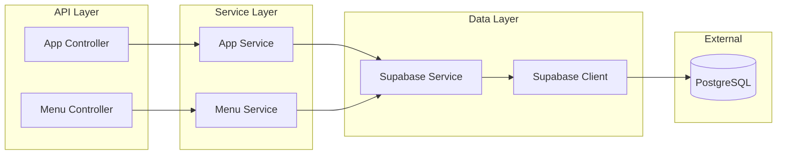

# 🍽️ Restaurant Backend API

NestJS backend for the Restaurant Menu SaaS platform. Provides RESTful APIs for multi-tenant restaurant menu management.

---

## 🏗️ Architecture



---

## 📁 Module Structure

```
src/
├── main.ts                 # Application entry point
├── app.module.ts           # Root module
├── app.controller.ts       # Health + Contact endpoints
├── app.service.ts          # Contact business logic
│
├── menu/                   # Menu Feature Module
│   ├── menu.module.ts      # Module definition
│   ├── menu.controller.ts  # Menu endpoints
│   ├── menu.service.ts     # Menu business logic
│   └── menu.types.ts       # TypeScript interfaces
│
└── supabase/               # Database Module (Global)
    ├── supabase.module.ts  # Module definition
    └── supabase.service.ts # Database client wrapper
```

---

## 🚀 API Reference

### Health Check

```http
GET /health
```

**Response:**

```json
{ "ok": true }
```

---

### Get Restaurant Menu

```http
GET /api/:slug/menu?days=3
```

| Parameter | Type  | Description                                       |
| --------- | ----- | ------------------------------------------------- |
| `slug`    | path  | Restaurant identifier (e.g., `terracotta-bistro`) |
| `days`    | query | Number of days to fetch (1-7, default: 3)         |

**Response:**

```json
{
  "timezone": "Asia/Colombo",
  "days": 3,
  "dateKeys": ["2026-01-31", "2026-02-01", "2026-02-02"],
  "menus": [
    {
      "date": "2026-01-31",
      "updatedAt": "10:30 AM",
      "highlight": {
        "badge": "Chef's Selection",
        "title": "Today's Highlight",
        "description": "Pan-Seared Arctic Char..."
      },
      "sections": [
        {
          "id": "uuid",
          "title": "Small Plates",
          "hours": "11:00 AM — 9:00 PM",
          "items": [
            {
              "id": "uuid",
              "name": "Burrata & Fig",
              "price": 18,
              "description": "Creamy Puglia burrata...",
              "tags": ["V", "GF"],
              "badge": "Popular",
              "imageUrl": "https://..."
            }
          ]
        }
      ]
    }
  ]
}
```

---

### Get Menu by Date

```http
GET /api/:slug/menu/:dateKey
```

| Parameter | Type | Description                 |
| --------- | ---- | --------------------------- |
| `slug`    | path | Restaurant identifier       |
| `dateKey` | path | Date in `YYYY-MM-DD` format |

---

### Get Contact Info

```http
GET /api/:slug/contact
```

**Response:**

```json
{
  "restaurantName": "The Terracotta Bistro",
  "phoneDisplay": "(555) 123-4567",
  "phoneTel": "+15551234567"
}
```

---

## 💻 Local Development

### Prerequisites

- Node.js 20+
- Supabase account with database set up

### Setup

```bash
# Install dependencies
npm install

# Create environment file
cp .env.example .env

# Edit .env with your Supabase credentials
# SUPABASE_URL=https://your-project.supabase.co
# SUPABASE_ANON_KEY=your-anon-key

# Run in development mode
npm run start:dev
```

### Available Scripts

| Command               | Description             |
| --------------------- | ----------------------- |
| `npm run start`       | Start production server |
| `npm run start:dev`   | Start with hot reload   |
| `npm run start:debug` | Start with debugger     |
| `npm run build`       | Compile TypeScript      |
| `npm run test`        | Run unit tests          |
| `npm run test:e2e`    | Run end-to-end tests    |
| `npm run lint`        | Run ESLint              |

---

## 🗄️ Database Migrations

SQL migration files are in `supabase/migrations/`:

| File                             | Description             |
| -------------------------------- | ----------------------- |
| `001_initial_schema.sql`         | Creates all tables      |
| `002_seed_data.sql`              | Seeds Terracotta Bistro |
| `003_additional_restaurants.sql` | Adds 2 test restaurants |

Run these in order via Supabase SQL Editor.

---

## 🐳 Docker

### Build

```bash
docker build -t restaurant-backend:latest .
```

### Run Locally

```bash
docker run -p 4000:8080 \
  -e SUPABASE_URL=your_url \
  -e SUPABASE_ANON_KEY=your_key \
  restaurant-backend:latest
```

### Push to Docker Hub

```bash
docker tag restaurant-backend:latest your-username/restaurant-backend:latest
docker push your-username/restaurant-backend:latest
```

---

## ☁️ Cloud Run Deployment

```bash
gcloud run deploy restaurant-backend \
  --image your-username/restaurant-backend:latest \
  --platform managed \
  --region us-central1 \
  --allow-unauthenticated \
  --set-env-vars SUPABASE_URL=xxx,SUPABASE_ANON_KEY=xxx
```

---

## 🔧 Environment Variables

| Variable            | Required | Default | Description            |
| ------------------- | -------- | ------- | ---------------------- |
| `SUPABASE_URL`      | Yes      | -       | Supabase project URL   |
| `SUPABASE_ANON_KEY` | Yes      | -       | Supabase anonymous key |
| `PORT`              | No       | 4000    | Server port            |

---

## 🧪 Testing

```bash
# Unit tests
npm run test

# E2E tests
npm run test:e2e

# Coverage report
npm run test:cov
```

---

## 📝 Adding a New Endpoint

1. **Add route** in controller:

```typescript
@Get('new-endpoint')
async newEndpoint(@Param('slug') slug: string) {
  return this.myService.getData(slug);
}
```

2. **Add business logic** in service:

```typescript
async getData(slug: string) {
  const supabase = this.supabaseService.getClient();
  const { data } = await supabase.from('table').select('*');
  return data;
}
```

3. **Add types** in `menu.types.ts` if needed

---

## 📄 License

MIT
