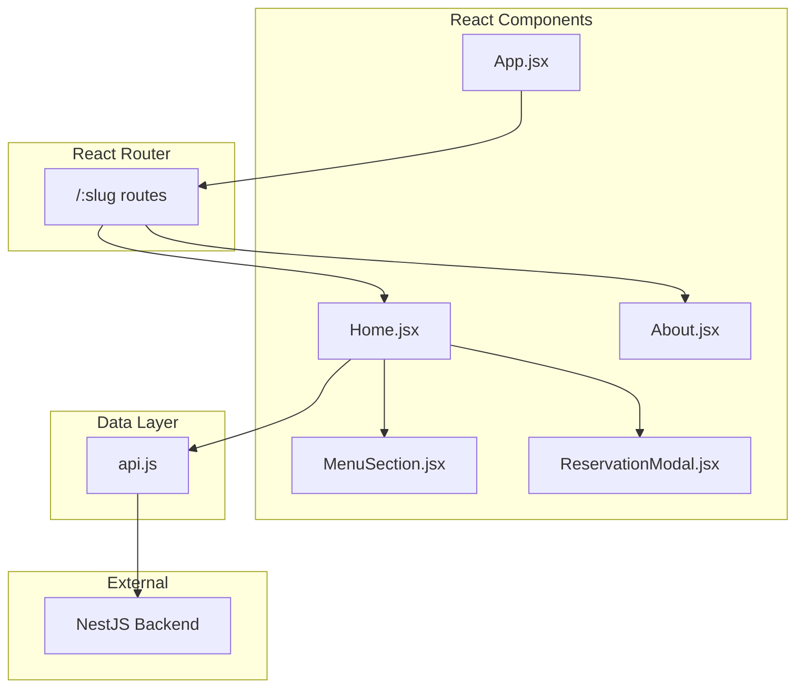
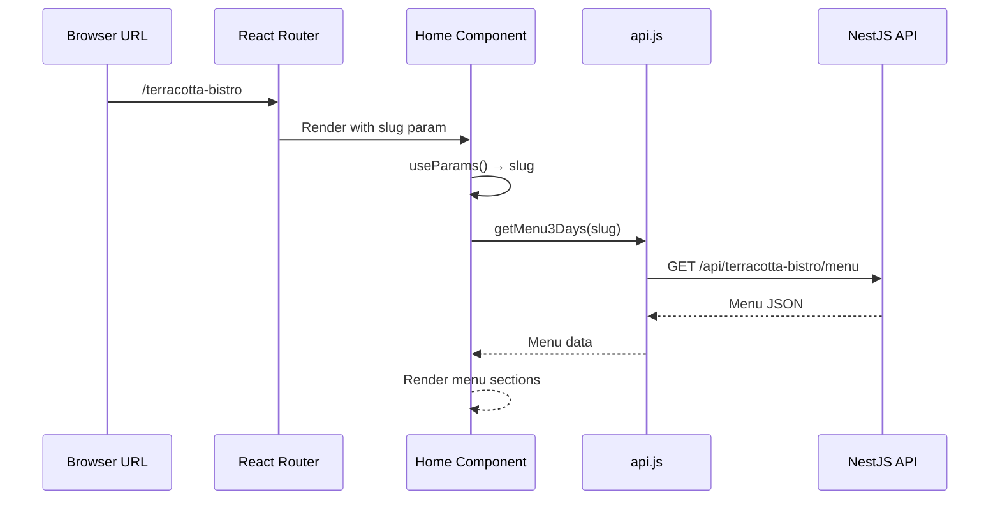

# 🍽️ Restaurant Menu Frontend

React + Vite frontend for the Restaurant Menu SaaS platform. Provides a beautiful, responsive menu viewing experience for customers.

---

## 🏗️ Architecture



---

## 📁 Project Structure

```
src/
├── main.jsx              # React entry point
├── App.jsx               # Router configuration
├── App.css               # Global styles
├── index.css             # Tailwind imports
│
├── pages/
│   ├── Home.jsx          # Main menu page
│   └── About.jsx         # About/story page
│
├── ui/
│   ├── MenuSection.jsx   # Menu section component
│   └── ReservationModal.jsx  # Contact modal
│
├── lib/
│   └── api.js            # Backend API client
│
└── assets/               # Static assets
```

---

## 🔄 Data Flow



---

## 🚀 Routes

| Path           | Component | Description                       |
| -------------- | --------- | --------------------------------- |
| `/:slug`       | Home      | Restaurant menu page              |
| `/:slug/about` | About     | Restaurant story page             |
| `/`            | Redirect  | Redirects to `/terracotta-bistro` |

---

## 💻 Local Development

### Prerequisites

- Node.js 18+
- Backend API running (see backend README)

### Setup

```bash
# Install dependencies
npm install

# Create environment file (optional)
cp .env.example .env

# Start development server
npm run dev
```

App runs at `http://localhost:5173`

### Available Scripts

| Command           | Description                      |
| ----------------- | -------------------------------- |
| `npm run dev`     | Start dev server with hot reload |
| `npm run build`   | Build for production             |
| `npm run preview` | Preview production build         |
| `npm run lint`    | Run ESLint                       |

---

## 🔧 Environment Variables

| Variable        | Required | Default                 | Description     |
| --------------- | -------- | ----------------------- | --------------- |
| `VITE_API_BASE` | No       | `http://localhost:4000` | Backend API URL |

**Example `.env`:**

```
VITE_API_BASE=http://localhost:4000
```

**Production:**

```
VITE_API_BASE=https://your-cloudrun-service.run.app
```

---

## 🎨 Styling

- **Tailwind CSS** — Utility-first CSS framework
- **Custom theme** — Terracotta color palette
- **Dark mode** — Automatic based on system preference
- **Responsive** — Mobile-first design

### Theme Colors

| Color                   | Usage                                       |
| ----------------------- | ------------------------------------------- |
| `primary`               | Buttons, links, accents (terracotta orange) |
| `charcoal`              | Main text                                   |
| `muted-brown`           | Secondary text                              |
| `background-light/dark` | Page backgrounds                            |

---

## 📱 Key Components

### Home.jsx

Main menu page with:

- Hero section with daily highlight
- Date tabs (Today, Tomorrow, etc.)
- Menu sections with items
- Sticky "Reserve Now" button
- Contact modal

### MenuSection.jsx

Displays a menu category:

- Section title and hours
- Grid of menu items with images
- Price and dietary tags

### ReservationModal.jsx

Contact overlay:

- Phone number display
- Click-to-call link

---

## 🧪 Adding a New Page

1. Create component in `src/pages/`:

```jsx
export default function NewPage() {
  const { slug } = useParams();
  return <div>New page for {slug}</div>;
}
```

2. Add route in `App.jsx`:

```jsx
<Route path="/:slug/new-page" element={<NewPage />} />
```

---

## 📦 Build for Production

```bash
# Build
npm run build

# Preview locally
npm run preview

# Output in dist/ folder
```

### Deployment Options

- **Vercel** — `vercel deploy`
- **Netlify** — Connect Git repo
- **Static hosting** — Upload `dist/` folder
- **Docker** — Create Nginx container with `dist/`

---

## 📄 License

MIT
